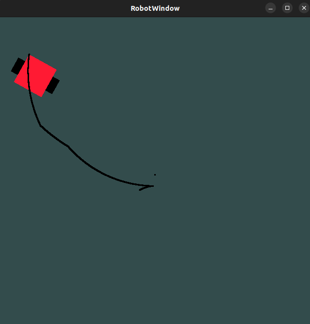

### GL robot Simulator
 This project is meant to be a framework for visually simulating various robots under various simulation conditions

### Whats been done so far
 For now the user can enter a set of inputs consisting of YawRates and Velocity as input to a differential robot and the RobotWindow should simulate the behaviour of the Differential Robot

### Steps on building the project
```
    mkdir -p build
    cd build 
    cmake .. 
    make
```
Once this is done create a .txt file name sample.txt in the build folder
The CSV should look something like this , The first column is Velocity X-Y direction and the second column is the YawRate
```
    //Format of sample.txt
    1.5,0.5
    0.3,0.1
```

### Some peek into the simulation
Its not much but its honest work, I am learning my self in this entire process here is and image attached for a robot with a timestamped input condition


#### WIP (Work In Progress)
Things that are in progress are 
1- Multiple Robot Models
2- 3D animations
3- An Appealing and Light Weight UI
4- Windows Support